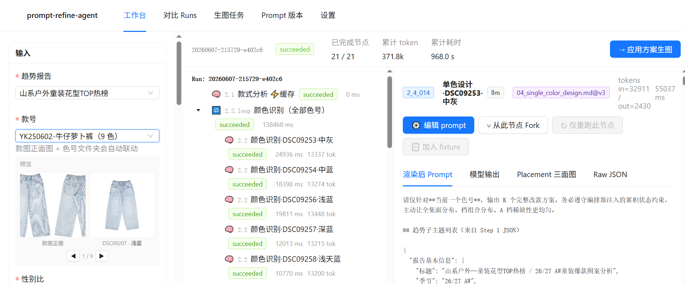
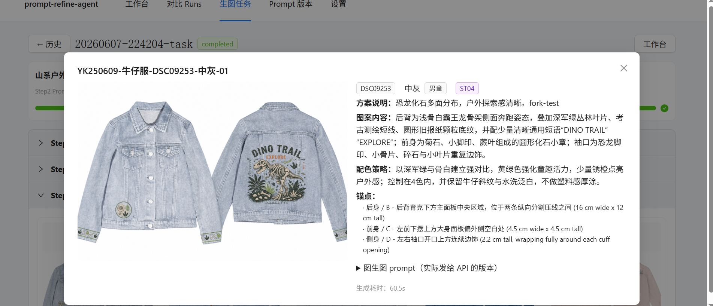
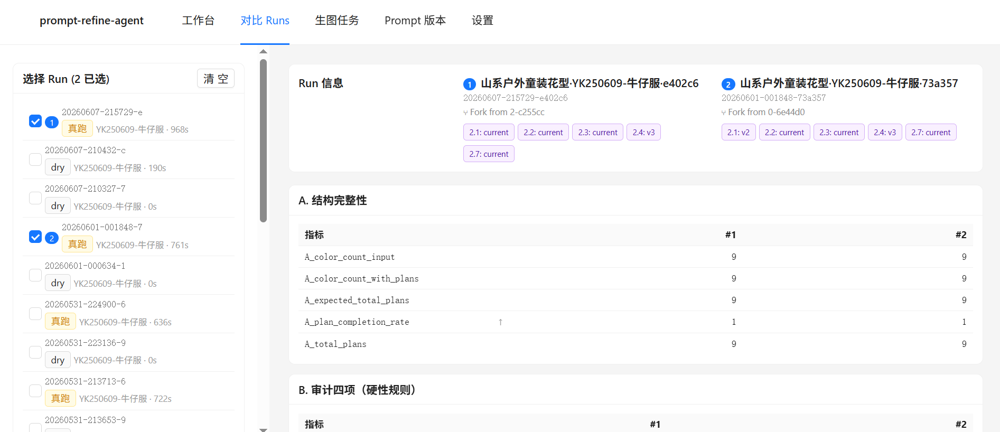
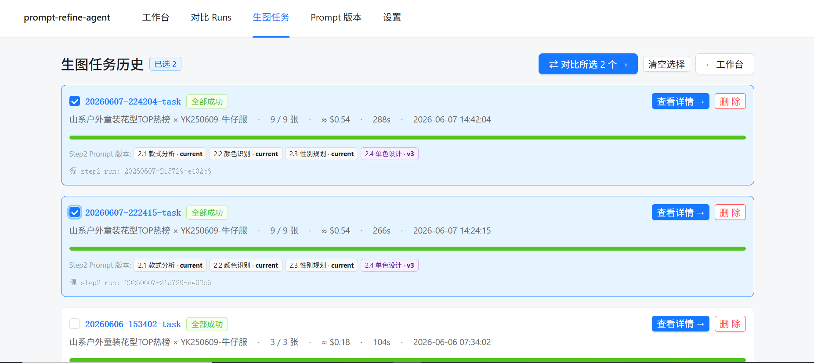

# prompt-refine-agent

> 一个面向童装牛仔印花设计场景的 **agentic Prompt 工程工作台**：
> 把一条"趋势报告 → 单款多色设计方案 → 批量生图"的 LLM 流水线拆成 **7 个可观测、可分别调试的 agent 节点**，
> 给设计师/算法工程师提供「**实时 trace 树 + Prompt 多版本 + Fork 缓存复用 + 多 run 横向对比 + 生图任务归档**」的完整闭环。

[](LICENSE)
[](https://www.python.org/)
[](https://fastapi.tiangolo.com/)
[](https://react.dev/)

---

## 一、它能解决什么问题

如果你正在做一个**多步骤、多 prompt 的 LLM 流水线**，你大概率会遇到：

- 一条流水线跑一次要 10+ 分钟，改一个 prompt 又得跑一遍 → **迭代慢**
- 看不到 agent "想了什么"，输出不好不知道哪个环节出了问题 → **调试黑盒**
- 改 prompt 后效果是真的好了还是错觉？没有客观对比 → **质量难判断**
- 跑出来的方案最终要进入下游（如生图），方案+图+prompt 散落在文件夹各处 → **归档混乱**

`prompt-refine-agent` 把这些痛点系统解决。

---

## 二、截图速览

<table>
  <tr>
    <td width="50%" align="center">
      <br/>
      <sub><b>节点级 Prompt 调试 + Fork</b>：在任意节点打开 Prompt 编辑抽屉直接改 system/user template，存版本后一键 Fork 重跑——上游 ⚡ 缓存复用、仅重跑改了的节点 + 下游</sub>
    </td>
    <td width="50%" align="center">
      <br/>
      <sub><b>生图任务详情归档</b>：每张图配套保存色号方案、子主题、锚点列表、配色策略、七段式图生图 prompt 全文——前后端完整链路归档体验</sub>
    </td>
  </tr>
  <tr>
    <td width="50%" align="center">
      <br/>
      <sub><b>多 Run 横向指标对比</b>：勾选 ≥2 个 Run，自动按 6 类 30+ 指标算差值（绿涨红跌），并展示每个 Run 的 prompt bundle 版本组——客观判断"改 prompt 是否真的变好了"</sub>
    </td>
    <td width="50%" align="center">
      <br/>
      <sub><b>多生图任务对比</b>：选 ≥2 个生图任务按色号自动对齐 grid，逐色号看图差 + prompt diff——锁定"哪句 prompt 改动让图变好/变坏"</sub>
    </td>
  </tr>
</table>

---

## 三、核心能力一览

| 能力 | 实现 |
|---|---|
| **Step 2 拆 7 节点 agent loop** | 单 prompt 巨型 step2 拆成 5 个独立 LLM 节点 + 1 个 Python 审计 tool + 1 个 decision/redesign 循环 |
| **实时 Trace 树** | SSE 推送每个节点的 started/completed/failed 事件，浏览器秒级看到 agent 进度 |
| **Prompt 多版本管理** | 5 个子 prompt 各自独立 `current/v1/v2/...` 版本；存盘、切换、diff、整组 Bundle 视图 |
| **Fork-from-node** | 改某个 prompt 后只跑该节点 + 下游，上游节点全部 ⚡ 缓存复用，**5 分钟降到 30 秒** |
| **节点级容错 + 单色修复** | 2.2 颜色识别单色失败不影响其他色号；可对失败色号原地"重新识别 + 重设计 2.4"，不重跑整组 |
| **多 Run 横向对比** | 选 ≥2 个 step2 run，按 ABCDEF 6 类 30+ 指标做差值对比，绿涨红跌一目了然 |
| **量化 eval CLI** | `python scripts/eval.py *.json --only-diff` 命令行就能对比任意输出的指标 |
| **Step 3 生图集成** | 选中方案 → gpt-image-2 并发生图 → 每张图自动配 prompt 归档 |
| **生图任务历史 + 多任务对比** | 所有生图任务全量快照（step1/2/3 prompt + 图）；按色号对齐对比，含 prompt diff |

---

## 四、技术栈

| 层 | 选型 | 说明 |
|---|---|---|
| 后端 | Python 3.10+ · FastAPI · SQLite | 单进程 server；元数据存 SQLite，trace/cache 全文件落盘 |
| 前端 | Vite · React 18 · TypeScript · Ant Design · TanStack Query · Zustand | 单页应用；SSE 实时推送 |
| Agent 核心 | OpenAI Responses API（流式）+ ThreadPoolExecutor | gpt-5.5 做方案设计；gpt-image-2 做生图 |
| 审计 | 纯 Python 4 项规则判定 | 面分布 / 跨面占比 / A 档稀缺 / 位置多样性 |
| 状态管理 | 文件系统 + SQLite | trace.jsonl + node IO JSON + run_dir 隔离 |

---

## 五、5 分钟快速开始

### 前置

- Python 3.10+
- Node.js 18+
- OpenAI API key

### 安装

```bash
git clone <your-repo-url>
cd prompt-refine-agent

# 后端
python -m venv .venv
source .venv/bin/activate              # Windows: .venv\Scripts\activate
pip install -r requirements.txt

# 配 API key
cp .env.example .env
# 编辑 .env 填入 OPENAI_API_KEY

# 前端
cd frontend
npm install
cd ..
```

### 启动（需要 3 个终端）

```bash
# 终端 A：后端
uvicorn backend.main:app --reload --port 8000

# 终端 B：前端
cd frontend && npm run dev

# 终端 C（可选）：CLI eval
python scripts/eval.py <step2_output.json>
```

打开浏览器 http://localhost:5173 即可。

### 端到端流程

```
1. 工作台 → 选趋势报告 + 款号 → 点「空跑」验证 prompt 渲染（不烧 token）
2. 点「真跑」启动完整 agentic step2（约 12 分钟，会烧 token）
3. trace 树实时长出 23 个节点，点节点看 prompt + 输出
4. 不满意 → 点节点的「⚙ 编辑 prompt」改一行 → 存 v2 → 「用此版本跑」触发 Fork
5. Fork 用上游缓存 → 仅重跑改了的节点 + 下游（30 秒-1 分钟）
6. 跑出满意结果 → RunHeader 点「→ 应用方案生图」
7. 勾选要生的方案（默认全选） → gpt-image-2 并发出图
8. 生图任务历史归档，可多选对比，按色号对齐看 prompt diff + 图差
```

---

## 六、项目结构

```
prompt-refine-agent/
├── README.md
├── requirements.txt
├── .env.example
│
├── run_agent.py                       # CLI：不开 backend 也能跑 step2
├── scripts/
│   ├── eval.py                        # 命令行 eval：算指标 + 横向对比
│   └── smoke_test_backend.py          # 后端 SSE 联调测试
│
├── prompts/                           # Prompt 版本库
│   ├── step1/
│   │   └── trend_parse.md
│   ├── step2/
│   │   ├── 01_style_analysis.md       # 2.1 款式分析
│   │   ├── 02_color_recognition.md    # 2.2 颜色识别
│   │   ├── 03_gender_planning.md      # 2.3 性别比规划
│   │   ├── 04_single_color_design.md  # 2.4 单色设计
│   │   └── 04b_redesign_constraint.md # 2.7 局部重设计
│   └── placement_schema.json
│
├── tool/                              # Python 核心包
│   ├── orchestrator/                  # Step 2 agentic 编排器
│   │   ├── orchestrator.py            #   Step2Run 主类
│   │   ├── nodes.py                   #   7 节点实现
│   │   ├── audit.py                   #   4 项 Python 审计
│   │   ├── llm.py                     #   OpenAI Responses 薄包装
│   │   ├── prompts.py                 #   Prompt 加载 + 版本绑定
│   │   └── trace.py                   #   Trace 事件 + 节点 IO 缓存
│   └── generator/                     # Step 3 生图编排器
│       └── runner.py                  #   ThreadPool 并发 + gpt-image-2
│
├── backend/                           # FastAPI 后端
│   ├── main.py
│   ├── db.py                          # SQLite schema + CRUD
│   ├── schemas.py
│   ├── sse.py                         # Server-Sent Events
│   └── routers/
│       ├── runs.py                    # /api/v1/runs (CRUD + fork + recognize)
│       ├── tasks.py                   # /api/v1/tasks (生图任务 + compare)
│       ├── prompts.py                 # /api/v1/prompts (版本管理)
│       ├── trends.py                  # /api/v1/trends (上游数据浏览)
│       ├── styles.py                  # /api/v1/styles
│       └── settings.py                # /api/v1/settings
│
├── frontend/                          # React 前端
│   ├── package.json
│   ├── vite.config.ts
│   └── src/
│       ├── App.tsx
│       ├── api/client.ts              # axios + SSE
│       ├── store/runStore.ts          # zustand 全局状态
│       ├── routes/
│       │   ├── WorkbenchPage.tsx      # 三栏工作台（输入/Trace 树/节点详情）
│       │   ├── ComparePage.tsx        # Run 横向对比
│       │   ├── PromptsPage.tsx        # Prompt 版本 Bundle 视图
│       │   ├── TasksListPage.tsx      # 生图任务历史
│       │   ├── TaskNewPage.tsx        # 新建生图任务（选方案）
│       │   ├── TaskDetailPage.tsx     # 任务详情（step1/2/3 折叠）
│       │   └── TasksComparePage.tsx   # 多任务按色号对齐对比
│       └── components/
│           ├── InputsPanel/           # 工作台左栏（输入 + 历史）
│           ├── TraceTree/             # 工作台中栏（实时 trace 树）
│           ├── NodeDetail/            # 工作台右栏（节点详情 + 编辑/Fork）
│           ├── RunHeader/             # 顶部状态条（实时 token/耗时）
│           ├── PromptDrawer/          # 节点 Prompt 编辑抽屉
│           └── FaceVisualizer/        # 三面 placement SVG
│
├── eval/                              # 量化评估模块
│   ├── metrics.py                     # 6 类 30+ 指标
│   ├── runner.py                      # 单/多 run 评估入口
│   ├── compare.py                     # 横向对比
│   └── _audit.py                      # 审计本地副本（解耦 orchestrator）
│
├── runs/                              # Run 产物（gitignored）
│   └── {trend}_{style}/
│       ├── final_output.json
│       └── runs/{run_id}/
│           ├── trace.jsonl
│           └── *.json                 # 每节点 IO 缓存
│
└── data/                              # 本地数据库 + 生图（gitignored）
    ├── metadata.db
    └── task_images/{task_id}/*.png
```

---

## 七、Step 2 的 7 节点结构

```
┌──────────────────────────────────────────────────────────────────┐
│ 2.1 款式分析                          🧠 LLM    1 次              │
│   输入: 款图正反面 + 趋势 JSON                                    │
│   输出: 款图底色 / 三面可印花区域 / 趋势说明                       │
├──────────────────────────────────────────────────────────────────┤
│ 2.2 颜色识别                          🧠 LLM    N 次 (N=色号数)   │
│   每色号一次并发；单色失败不影响其他（容错）                       │
├──────────────────────────────────────────────────────────────────┤
│ 2.3 性别比规划                        🧠 LLM    1 次              │
├──────────────────────────────────────────────────────────────────┤
│ 2.4 单色设计                          🧠 LLM    N 次 (串行)       │
│   注入累积状态：A 档配额 + 已用面/档/位置 → 强制多样性              │
├──────────────────────────────────────────────────────────────────┤
│ 2.5 分布审计                          🔧 Tool   0 token            │
│   面分布 / 跨面占比 / A 档稀缺 / 位置多样性 4 项                    │
├──────────────────────────────────────────────────────────────────┤
│ 2.6 重做决策                          🔀 Decision                  │
│   通过 → 出 2.7；不通过 → 指出哪些色号需重做                       │
├──────────────────────────────────────────────────────────────────┤
│ 2.7 局部重设计                        🔁 Loop + LLM   条件触发     │
│   仅对违规色号重新出方案，最多 max_audit_rounds 轮                 │
└──────────────────────────────────────────────────────────────────┘
```

总体调用次数：`2 + 2N` 次 LLM（N=9 时约 20 次），用 `previous_response_id` 链可省 token，
当前实现走精简上下文重发策略，可控可缓存。

---

## 八、API 速览

完整 OpenAPI 文档：http://127.0.0.1:8000/docs

| 类别 | 路由 | 用途 |
|---|---|---|
| **Runs** | `POST /api/v1/runs` | 启动一次 step2 |
|  | `GET  /runs/{id}/stream` | SSE 实时进度 |
|  | `POST /runs/{id}/fork` | Fork 复用缓存 |
|  | `POST /runs/{id}/recognize-color` | 单色重识别（原地修复） |
|  | `POST /runs/{id}/redesign-single-color` | 重识别后级联重设计 2.4 |
|  | `GET  /runs/compare/multi?ids=a,b` | 多 run 横向指标对比 |
| **Prompts** | `GET  /prompts` | 列所有节点 + 版本树 |
|  | `POST /prompts/{node_id}/versions` | 存新版本 |
|  | `GET  /prompts/{node_id}/diff` | 两版本 diff |
| **Tasks** | `POST /tasks` | 创建生图任务 |
|  | `GET  /tasks/{id}/stream` | SSE 实时进度 |
|  | `POST /tasks/{id}/regenerate` | 单张图重生 |
|  | `GET  /tasks/compare/multi?ids=a,b` | 多任务按色号对齐对比 |
| **Trends/Styles** | `GET  /trends`, `GET /styles` | 浏览上游数据 |
| **Settings** | `GET/PATCH /settings` | `.env` 读写 |

---

## 九、Prompt 工程方法论（这套工具体现的设计哲学）

1. **量化先于精修** —— 改 prompt 前先有 eval；改完用 eval 验证，不靠直觉
2. **拆 prompt → 拆 agent** —— 大 prompt 拆成可独立调试的 LLM 节点 + 确定性 Python 审计
3. **缓存即版本控制** —— 节点 IO 全量落盘，Fork 时按业务编号 + Prompt 版本判断 cache hit/miss
4. **失败是常态** —— 容错（单色失败不挂全局）+ 修复路径（原地重识别 / 重设计 / Fork 重跑）
5. **存档第一位** —— 每次生图任务全量快照 step1+step2+prompt+图，不依赖源 run 留存

---

## 十、与上游 `ai-supply` 的关系

- **`ai-supply/`**：原始数据源 — 趋势报告 PDF / 款图 / 色号图 / placement_schema
- **`prompt-refine-agent/`**：工作台 — 不复制原始数据，通过路径引用 `../ai-supply/趋势报告/`、`../ai-supply/款图/`

如果你只想看本项目能跑通，**最小依赖是**：
- 一份 step1 输出 JSON（趋势解析结果）
- 一张款图正面图
- 一个色号文件夹（命名规则 `{色号代码}({色名}已使用).jpg`）

可以从 `ai-supply` 仓库克隆，或者自己造数据塞进对应目录。

---

## 十一、状态 / Roadmap

✅ **已完成**

- M0-M1 量化 eval + 后端 + SSE 联调
- M2-M3 前端工作台 + Prompt 编辑抽屉 + 版本管理
- M4 Fork-from-node 缓存复用 + 历史 run 装载
- M5 多 run 横向对比（按色号、按指标）
- M6-M7 生图任务 + 历史列表 + 详情页 + 实时 SSE 进度
- M8 多生图任务对比（按色号对齐 + prompt diff）
- 节点容错 + 单色级联重设计
- Prompt Bundle 整组视图

⏳ **可选扩展（按需）**

- 三面 SVG placement 精确坐标可视化
- SSE 重连 / 僵尸 run 清理 / cost 熔断
- 多人协作（task 归属 / 权限）
- 更多生图模型支持（DALL-E / SDXL / Flux）

---

## 十二、开发笔记

### 数据流向

```
用户 → InputsPanel → POST /runs
   ↓
后端 Step2Run （线程池）
   ↓
TraceWriter → trace.jsonl + 节点 IO 缓存
   ↓
SSE event_bus → 前端 EventSource
   ↓
zustand store → TraceTreePanel / NodeDetailPanel 实时渲染
```

### Fork 缓存判定

Step2Run 启动时扫源 run_dir 所有 `{node_id}_{slug}.json`，按 slug 索引到 `replay_cache`。
节点真跑前 `try_cache_lookup`：
1. 是否在 `force_miss_node_ids`（由 prompt 版本差异 + 用户显式 from_node_id 算出）→ miss
2. 缓存的 prompt_version 跟当前 `bundle.version_label` 是否一致 → 否则 miss
3. 命中 → 直接返回缓存 output，跳过 LLM 调用

### 状态翻盘

trace.jsonl 按时间顺序记录事件，**后出现的状态覆盖前出现的**。
单色重识别成功 → 追加新的 `node_completed` 覆盖原 `node_failed` →
扫子节点全部 succeeded → 追加 loop 父节点 `node_completed` →
扫无任何 failed → DB `runs.status` 从 `failed` 翻成 `succeeded_with_audit_warnings`。

---

## 十三、License

MIT — see [LICENSE](LICENSE).

---

## 致谢

- 基于 **OpenAI Responses API** 和 **gpt-image-2**
- UI 使用 **[Ant Design](https://ant.design/)**
- 后端基于 **[FastAPI](https://fastapi.tiangolo.com/)**

如果你觉得这套工具对自己的 LLM 流水线项目有启发，欢迎 ⭐ Star。
有问题/建议 → Issues 见。
